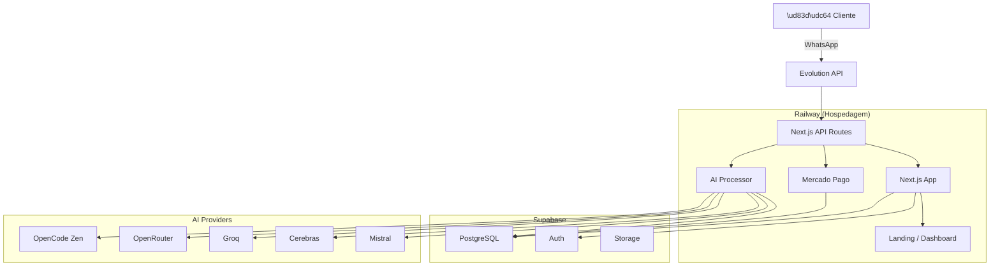
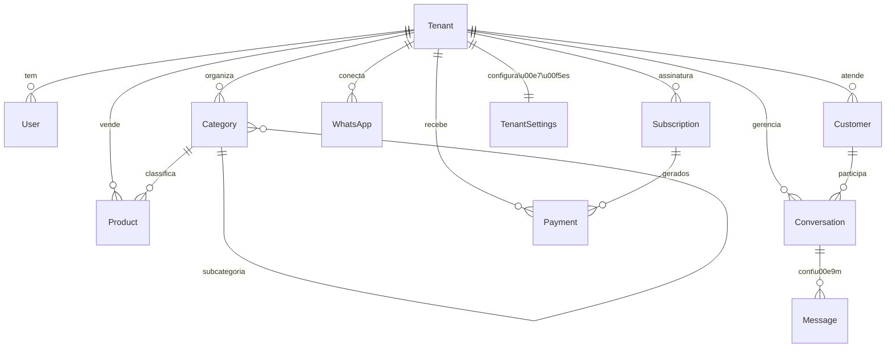

# WhatsAI - Funcion\u00e1rio Digital para WhatsApp

> **Documento Definitivo do Projeto** \n> Vers\u00e3o: 1.0.0 \n> Data: 29 de Junho de 2026

---

## \u00cdndice

1. [Vis\u00e3o do Produto](#1-vis\u00e3o-do-produto)
2. [Arquitetura Geral](#2-arquitetura-geral)
3. [Stack Tecnol\u00f3gica](#3-stack-tecnol\u00f3gica)
4. [Banco de Dados](#4-banco-de-dados)
5. [Sistema de IA](#5-sistema-de-ia)
6. [Sistema Multi-Tenant](#6-sistema-multi-tenant)
7. [Pagamentos](#7-pagamentos)
8. [WhatsApp](#8-whatsapp)
9. [Frontend & Dashboard](#9-frontend--dashboard)
10. [Seguran\u00e7a](#10-seguran\u00e7a)
11. [Deploy & Infra](#11-deploy--infra)
12. [Roadmap](#12-roadmap)
13. [Estrutura de Pastas](#13-estrutura-de-pastas)
14. [Vari\u00e1veis de Ambiente](#14-vari\u00e1veis-de-ambiente)
15. [API Endpoints](#15-api-endpoints)

---

## 1. Vis\u00e3o do Produto

### 1.1 Miss\u00e3o
Democratizar o atendimento ao cliente de qualidade para pequenos e m\u00e9dios neg\u00f3cios brasileiros atrav\u00e9s de Intelig\u00eancia Artificial.

### 1.2 O Problema
Pequenos neg\u00f3cios perdem vendas porque:\n- N\u00e3o conseguem atender clientes 24h\n- Demoram para responder no WhatsApp\n- Esquecem de fazer p\u00f3s-venda\n- N\u00e3o t\u00eam equipe para atendimento\n- Perdem o hist\u00f3rico dos clientes

### 1.3 A Solu\u00e7\u00e3o
Um **Funcion\u00e1rio Digital** que:\n- Atende clientes no WhatsApp 24h/dia\n- Vende, negocia, or\u00e7a e fecha pedidos\n- Lembra do hist\u00f3rico de cada cliente\n- Faz p\u00f3s-venda autom\u00e1tico\n- Funciona para qualquer nicho

### 1.4 P\u00fablico-Alvo\n- Restaurantes e padarias\n- Cl\u00ednicas e consult\u00f3rios\n- Pet shops e agropecu\u00e1rias\n- Lojas e e-commerces\n- Oficinas e prestadores de servi\u00e7o\n- Imobili\u00e1rias\n- Qualquer PME que usa WhatsApp

### 1.5 Planos
| Plano | Pre\u00e7o | WhatsApps | Conversas | Diferenciais |
|-------|--------|----------|----------|-------------|
| B\u00e1sico | R$ 97/m\u00eas | 1 n\u00famero | 500/m\u00eas | Cat\u00e1logo, Dashboard |
| Profissional | R$ 197/m\u00eas | 1 n\u00famero | Ilimitado | Mem\u00f3ria, P\u00f3s-venda |
| Premium | R$ 297/m\u00eas | 2 n\u00fameros | Ilimitado | API, Relat\u00f3rios, SLA |

---

## 2. Arquitetura Geral



---

## 3. Stack Tecnol\u00f3gica

| Camada | Tecnologia | Vers\u00e3o | Motivo |
|--------|-----------|---------|-------|
| Frontend | Next.js 15 | 15.x | SSR, App Router, performance |
| Linguagem | TypeScript | 5.x | Tipagem segura |
| Estiliza\u00e7\u00e3o | Tailwind CSS 4 | 4.x | Produtividade |
| ORM | Prisma | 6.x | Type-safe, migrations |
| Banco | PostgreSQL (Supabase) | 15.x | Relacional, pgvector |
| Auth | Supabase Auth | - | Gerenciado, seguro |
| IA | OpenRouter + OpenCode Zen + Groq + Cerebras + Mistral | - | Fallback m\u00faltiplo |
| Pagamentos | Mercado Pago | - | PIX, cart\u00e3o, assinatura |
| WhatsApp | Evolution API | - | Open-source, multi-instance |
| Hospedagem | Railway | - | Deploy autom\u00e1tico via GitHub |
| Storage | Supabase Storage | - | S3-compat\u00edvel |

---

## 4. Banco de Dados

### 4.1 Entidades Principais



### 4.2 Modelo Multi-Tenant
Cada empresa (tenant) \u00e9 completamente isolada:\n- Dados separados por `tenantId`\n- RLS no Supabase\n- Inst\u00e2ncia WhatsApp pr\u00f3pria\n- Configura\u00e7\u00f5es independentes\n
---

## 5. Sistema de IA

### 5.1 Arquitetura de Fallback

```
Mensagem do Cliente
    \u2193
1\u00ba TENTATIVA: OpenCode Zen (DeepSeek V4 Flash) \u2014 GRATUITO
    \u2193 (se falhar)
2\u00aa TENTATIVA: OpenRouter (Gemini Flash) \u2014 GRATUITO
    \u2193 (se falhar)
3\u00aa TENTATIVA: Groq (Llama 3.3 70B) \u2014 GRATUITO
    \u2193 (se falhar)
4\u00aa TENTATIVA: Cerebras (Llama 3.1 8B) \u2014 GRATUITO
    \u2193 (se falhar)
5\u00aa TENTATIVA: Mistral (Mistral Small) \u2014 GRATUITO
    \u2193 (se todos falharem)
ERRO: Todos os provedores offline
```

### 5.2 Sistema de Personalidade
Cada empresa pode configurar:\n- **Tom de voz**: formal, casual, t\u00e9cnico\n- **Regras**: n\u00e3o vender fiado, n\u00e3o dar desconto\n- **Mensagem de boas-vindas** personalizada\n- **Limites**: hor\u00e1rio de funcionamento, dias \u00fateis\n
### 5.3 Mem\u00f3ria\n- A IA lembra de cada cliente pelo telefone\n- Hist\u00f3rico completo de conversas\n- Prefer\u00eancias e \u00faltimas compras\n- Embeddings com pgvector para busca sem\u00e2ntica (futuro)\n
---

## 6. Sistema Multi-Tenant

```
WhatsAI Platform
    \u251c\u2500\u2500 Padaria do Jos\u00e9 (tenant_abc)
    \u2502   \u251c\u2500 WhatsApp: 5511999991111
    \u2502   \u251c\u2500 Clientes: 342
    \u2502   \u251c\u2500 Produtos: 47
    \u2502   \u2514\u2500 Plano: Profissional R$ 197/m\u00eas
    \u2502
    \u251c\u2500\u2500 Pet Shop da Ana (tenant_def)
    \u2502   \u251c\u2500 WhatsApp: 5511999992222
    \u2502   \u251c\u2500 Clientes: 89
    \u2502   \u251c\u2500 Produtos: 120
    \u2502   \u2514\u2500 Plano: B\u00e1sico R$ 97/m\u00eas
```

---

## 7. Pagamentos

### 7.1 Mercado Pago\n- **PIX**: Instant\u00e2neo, sem taxa para o cliente\n- **Cart\u00e3o de Cr\u00e9dito**: Recorr\u00eancia autom\u00e1tica\n- **Assinaturas**: Cobran\u00e7a mensal autom\u00e1tica\n- **Webhooks**: Notifica\u00e7\u00e3o de pagamento confirmado\n
### 7.2 Fluxo de Cobran\u00e7a\n```
1. Cliente se cadastra (trial 7 dias)
2. Escolhe o plano
3. Sistema gera cobran\u00e7a no Mercado Pago
4. Cliente paga via PIX ou cart\u00e3o
5. Mercado Pago envia webhook
6. Sistema ativa a assinatura
7. Todo m\u00eas: cobran\u00e7a autom\u00e1tica
```

---

## 8. WhatsApp

### 8.1 Evolution API\n- Open-source, auto-hospedado\n- Suporte a m\u00faltiplas inst\u00e2ncias\n- QR Code para conex\u00e3o\n- Envio de mensagens, imagens, \u00e1udios\n- Webhook para receber mensagens\n
### 8.2 Fluxo de Mensagem\n```
1. Cliente envia mensagem no WhatsApp
2. Evolution API recebe via webhook
3. Sistema busca contexto (cliente, hist\u00f3rico)
4. IA processa e gera resposta
5. Sistema envia resposta via Evolution API
6. Mensagens s\u00e3o salvas no banco
```

---

## 9. Frontend & Dashboard

### 9.1 P\u00e1ginas
| Rota | Descri\u00e7\u00e3o |
|------|-------------|
| `/` | Landing page |
| `/login` | Login do dono do neg\u00f3cio |
| `/register` | Cadastro com trial |
| `/dashboard` | Vis\u00e3o geral (m\u00e9tricas) |
| `/dashboard/atendimentos` | Conversas do WhatsApp |
| `/dashboard/clientes` | CRM de clientes |
| `/dashboard/produtos` | Cat\u00e1logo de produtos |
| `/dashboard/configuracoes` | Configura\u00e7\u00f5es da IA |

---

## 10. Seguran\u00e7a

- **Senhas**: Hash via Supabase Auth\n- **API Keys**: Apenas em vari\u00e1veis de ambiente\n- **GitHub**: .env no .gitignore\n- **Multi-Tenant**: Dados isolados por tenantId\n- **HTTPS**: For\u00e7ado pelo Railway\n- **Webhooks**: Valid
